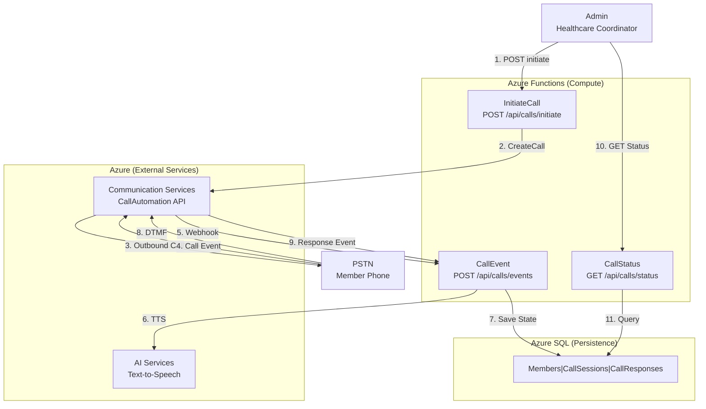

# System Design: Callistra Agent
**Interview Framework: 5-Step Analysis**

---

## Step 1: Understand the Problem (10 min)

### Requirements
- **Functional**: Initiate outbound PSTN calls → Play healthcare questions via TTS → Capture DTMF responses → Persist call data
- **Non-Functional**: 
  - Throughput: 100 calls/day MVP (1-2 calls/min peak)
  - Latency: Call connect within 5 sec, response capture within 10 sec
  - Availability: 99% uptime, HIPAA-aware (person-detection before PHI)
  - Durability: No lost call responses or session data

### Constraints
- **Cost**: Minimize infrastructure spend (consumption-based services preferred)
- **Complexity**: MVP must ship in 1 day (3 endpoints, 3 tables max)
- **Integration**: Reuse existing Azure Communication Services + Azure AI Services (shared resource group)
- **Data**: Healthcare member profiles exist in SQL (Member table)

### Assumptions
- Members have valid phone numbers in database
- Call volume predictable (batch processing feasible)
- Network reliability acceptable for real-time DTMF capture

---

## Step 2: High-Level Design (10 min)

### API Design (REST - Resource Oriented)

```
POST /api/calls/initiate/{memberId}
├─ Request: { callbackUrl: "string" }
├─ Response: { callSessionId: "uuid", status: "Initiated" }
└─ Purpose: Trigger outbound call to member

POST /api/calls/events
├─ Request: CloudEvents { eventType: "CallConnected|RecognizeCompleted|CallDisconnected", data: {...} }
├─ Response: { status: "Processed" }
└─ Purpose: Receive ACS webhooks, orchestrate call flow

GET /api/calls/status/{callConnectionId}
├─ Response: { callSessionId: "uuid", status: "Connected|PersonDetected|Disconnected", responses: [...] }
└─ Purpose: Query call status and DTMF responses for coordinator review
```

### High-Level Architecture



### Overall Design Pattern

- **Async Event-Driven**: ACS events trigger Functions via webhooks (not polling)
- **Stateless Compute**: Each Function invocation is independent; state in database
- **Cross-Resource-Group Pattern**: Reuse shared ACS + AI services via connection strings

---

## Step 3: Deep-Dive (10 min)

### Component Breakdown

#### Azure Functions (3 Endpoints)
```
InitiateCallFunction
├─ Validate memberId exists in Members table
├─ Create CallSession record (status: "Initiated")
├─ Invoke ACS CreateCall API
└─ Return callSessionId to admin

CallEventWebhookFunction
├─ Parse CloudEvents from ACS
├─ Route by eventType:
│  ├─ CallConnected → Play "Person Detection" prompt
│  ├─ RecognizeCompleted → Parse DTMF, save response, play next question
│  └─ CallDisconnected → Update CallSession status
└─ Orchestrate 3-question flow with 10-sec timeouts

CallStatusFunction
├─ Query CallSession by callConnectionId
├─ Fetch related CallResponses
└─ Return JSON with current status + DTMF history
```

#### Database Schema
```
Members (existing)
├─ MemberId (PK)
├─ PhoneNumber
└─ ...

CallSessions (new)
├─ CallSessionId (PK)
├─ MemberId (FK)
├─ CallConnectionId (from ACS)
├─ Status: Initiated|Connected|PersonDetected|Disconnected|Failed
├─ CreatedAt, UpdatedAt

CallResponses (new)
├─ ResponseId (PK)
├─ CallSessionId (FK)
├─ QuestionNumber (1-3)
├─ Response: "1" (DTMF) or "timeout"
└─ RecordedAt
```

#### Call Flow Detail
```
1. Admin calls POST /api/calls/initiate/123
2. Function validates Member(123) exists
3. Creates CallSession (status: Initiated)
4. Calls ACS.CreateCall(+1-555-1234, memberId=123)
5. ACS connects to member phone
6. ACS fires CallConnected webhook → Function
7. Function plays TTS: "Are you available? Press 1 yes, 2 no"
8. Waits 10 sec for DTMF
9. If timeout → plays "...no response, goodbye" → disconnects
10. If DTMF received → saves response → plays next question
11. After 3 questions → plays "Thank you" → disconnects
12. Admin calls GET /api/calls/status to view responses
```

### Dependency & Service Injection
```
Program.cs
├─ AddDbContext<CallistraAgentDbContext>
│  └─ Connection pooling, retry policies (3x, 10 sec backoff)
├─ AddScoped<ICallSessionRepository>
├─ AddScoped<ICallService>
├─ AddScoped<IQuestionService>
├─ AddSingleton<CallAutomationClient>
│  └─ Uses Managed Identity for ACS auth
└─ AddSingleton<CallSessionState>
   └─ In-memory event deduplication cache
```

---

## Step 4: Improve the Design (10 min)

### Bottleneck Analysis

| Bottleneck | Symptom | Solution |
|------------|---------|----------|
| **ACS Call Rate Limit** | 429 errors on spike | Queue calls, exponential backoff retry |
| **SQL Connection Pool** | "Connection timeout" at 50+ concurrent calls | Increase pool size, use connection pooling |
| **Webhook Delivery Latency** | DTMF responses delayed | Add idempotency key, process events async |
| **TTS Latency** | 3+ sec delay between prompt and DTMF wait | Cache TTS audio, pre-render prompts |
| **Member Lookup Perf** | SELECT * FROM Members blocks on 10K members | Add index on PhoneNumber + MemberId, use compiled query |

### Scaling Strategy

```
Current MVP (100 calls/day, 1-2 calls/min):
├─ Azure Functions: Consumption plan auto-scales (0-infinity)
├─ Azure SQL: Basic tier (5 DTUs) sufficient
└─ Cost: ~$120/month

Future (10K calls/day, 100 calls/min):
├─ Functions: Still consumption (no change needed)
├─ SQL: Upgrade to Standard S1 (20 DTUs) + enable geo-replication
├─ Add Redis cache for session state (reduce DB queries 80%)
├─ Implement call queuing with Service Bus (smooth load spikes)
└─ Cost: ~$500/month
```

### Replication & Partitioning
- **Data Replication**: Not needed for MVP (single region, SQL backups sufficient)
- **Partitioning**: Not needed (CallSessions < 100K rows in year 1, single table fits)
- **Caching**: In-memory CallSessionState (prevents event duplication on webhook retries)

---

## Step 5: Wrap Up (5 min)

### Summary
**Callistra Agent** is a serverless healthcare outreach system:
- **3 REST APIs** (initiate, webhook, status) for call orchestration
- **Event-driven** (ACS webhooks trigger Functions)
- **Persistent state** in SQL (Members, CallSessions, CallResponses)
- **Cross-RG reuse** of shared ACS + AI Services

### Design Decisions Justified

| Decision | Why | Alternative Rejected |
|----------|-----|----------------------|
| **Azure Functions (vs. App Service)** | Auto-scales to zero, pay-per-call, perfect for async webhooks | App Service = always-on cost, overkill for 100 calls/day |
| **SQL Database (vs. Cosmos DB)** | Relational schema clear, low cost, existing integration | Cosmos = higher cost, not needed for non-global system |
| **REST API (vs. GraphQL/RPC)** | Simple resource model, webhook-friendly, HIPAA logs easier | GraphQL = overengineering for 3 endpoints |
| **Webhook sync (vs. polling)** | Real-time response, no latency waste, event-native | Polling = 10x more API calls, higher cost |
| **Person-detection prompt (vs. AMD)** | HIPAA-safe (confirms human before PHI), simple logic | AMD = false positives on voicemail systems |

### Trade-offs Acknowledged
1. **Webhook reliability**: ACS retries up to 3x; if Function fails, event lost (acceptable for MVP, can add deadletter queue later)
2. **Session idempotency**: In-memory cache only; if Function crashes, duplicate webhook events possible (acceptable, logged)
3. **Scalability**: Sharding not needed yet (< 1M CallSessions/year); if 100K calls/day, revisit

### Alternatives to Explore
- **Queue-based architecture** (Service Bus instead of webhooks) = higher latency, better durability
- **Real-time DB (Realtime Database)** instead of SQL = faster, but more expensive
- **Multi-region failover** (future) = higher cost, not needed for MVP

---

**Interview Framework Complete ✓**  
**Ready for Technical Implementation** - See [tasks.md](../specs/001-minimal-call-agent/tasks.md)
